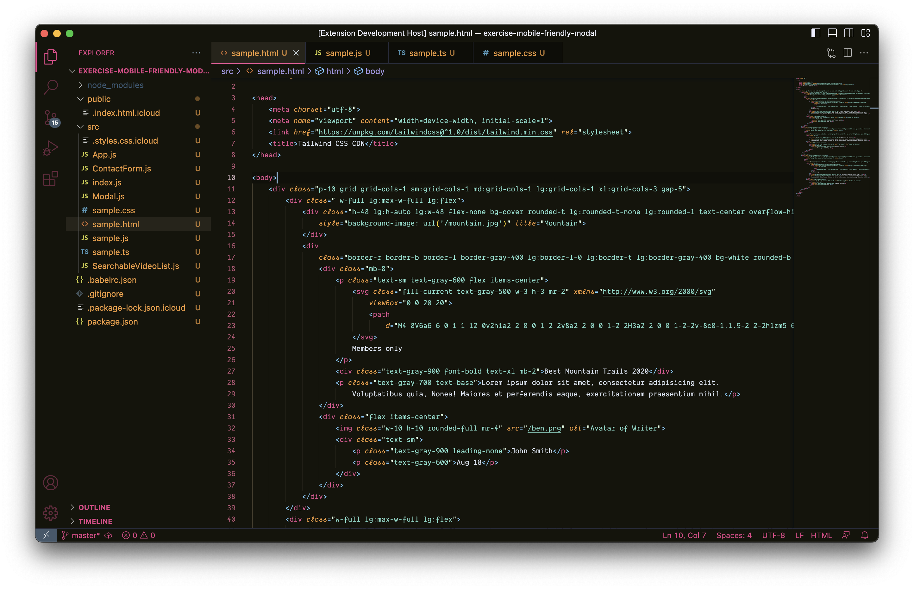
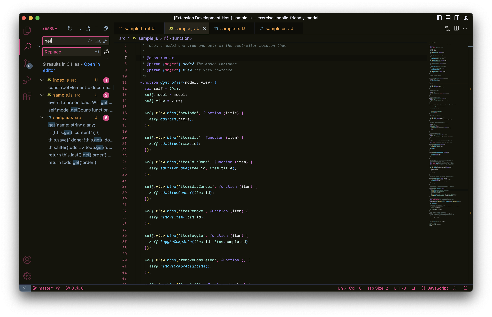
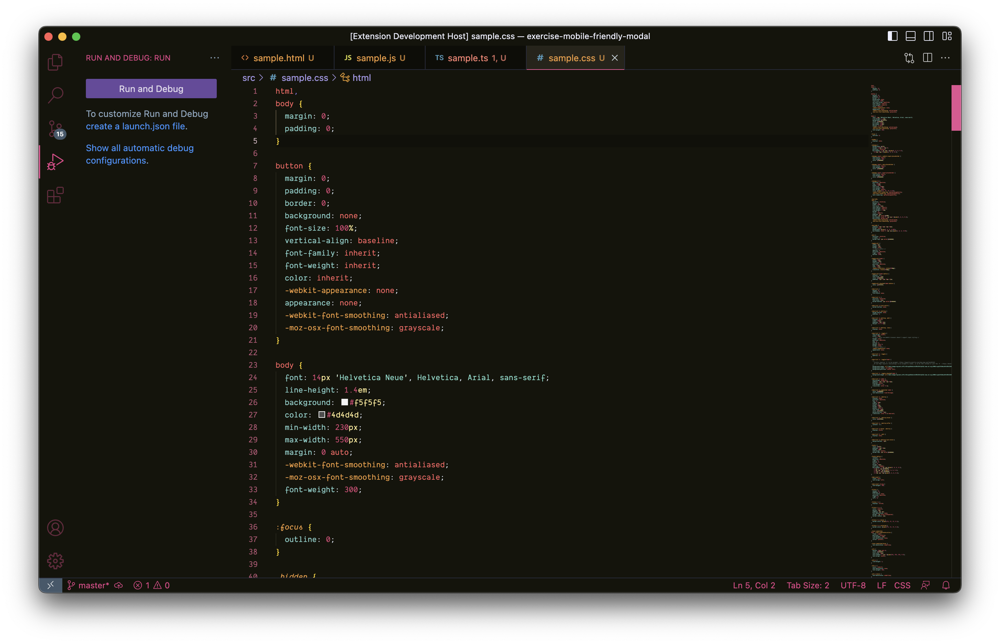

# Barbenheimer

Barbenheimer is a VS Code theme inspired by the Internet phenomenon of the same name. It combines the pink and playful aesthetics of Barbie with the dark and dramatic tones of Oppenheimer, creating a unique and fun contrast for your coding environment.

The theme is based on [Sarah Drasner](https://twitter.com/sarah_edo)'s [Night Owl theme](https://marketplace.visualstudio.com/items?itemName=sdras.night-owl), which is a beautiful and accessible theme with great color contrast and a dark background. Barbenheimer modifies some of the colors and fonts to match the mood and style of the two films.

Whether you're working on a fantasy comedy or an epic biographical drama, Barbenheimer will make your code look awesome. Try it today and join the Barbenheimer craze!

## Installation

To install Barbenheimer, follow these steps:

- Open VS Code
- Go to **Extensions** (Ctrl+Shift+X)
- Search for Barbenheimer
- Click **Install**
- Click **Reload**
- Go to Code > Settings > Theme > Color Theme
- Select **Barbenheimer**

## Screenshots

Here are some screenshots of Barbenheimer Theme Extension in action:

**Barbenheimer HTML**

**Barbenheimer JavaScript**

**Barbenheimer TypeScript**

**Barbenheimer CSS**

## Fonts

I am using a paid font titled [Dank Mono](https://dank.sh/). [Fira Code](https://github.com/tonsky/FiraCode) is a free one that works well too.

## Feedback

If you have any feedback or suggestions, please [open an issue](https://github.com/jpsanantonio/barbenheimer-vscode-theme/issues) or better yet, a [pull request](https://github.com/jpsanantonio/barbenheimer-vscode-theme/pulls). I would love to hear from you!

## License

Barbenheimer is licensed under the MIT License. See [LICENSE](LICENSE.md) for more details.
